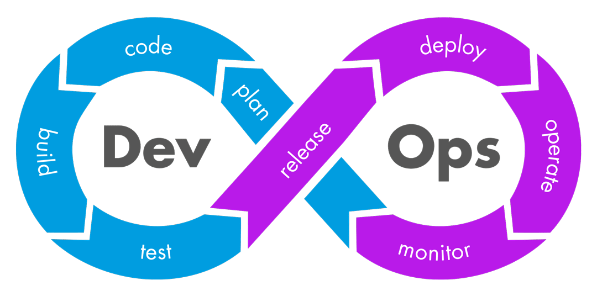
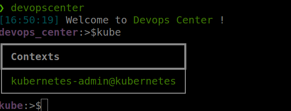
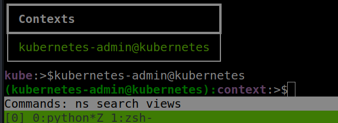
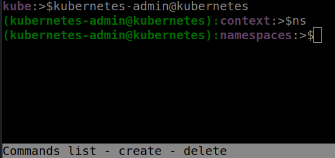

# Devops Center.

This application is meant to be used as a central point of the activities
that a devops use day by day.

For now the only command is kube, this command allows to use some cluster commands that will be useful by anyone and
is tired to type kubectl all the time o make some alias with kubectl.

This tool was inspired on the user interface of [pwdcat](https://github.com/calebstewart/pwncat) tool used on pentesting.


### Pre-requisites

* Python 3.8.2 or above
* python3-virtualenv

### *Before start*
Before start working you need to download the clusters definitions(aka kubeconfig) and copy it to the $HOME/.kube folder with any name.

```bash
$HOME/.kube/config_<cluster_name>
```
to the ones that use  cygwin, that will be the same.

## Installation
---

* Creates the virtual environment
    ```bash
    python3 -m venv --system-site-packages --copies <PATH_VITUALENV>

    export PATH="<PATH_VITUALENV>/bin:$PATH"

    ```
     * for linux machines execute
     ```bash
     source <PATH_VITUALENV>/bin/activate
     ```
     * for windows machines execute
     ```bash
     source <PATH_VITUALENV>/bin/Activate.ps1
     ```
     *  Intall the requirements
        ```bash
        <PATH_VITUALENV>/bin/pip install poetry
        ```
* Go To the project path
    * Install the dependencies
    ```bash
        <PATH_VITUALENV>/bin/poetry install
    ```
    *  Intall the system
        ```bash
        <PATH_VITUALENV>/bin/pip install .
        ```
    this will install the system on the virtualenv

    *  Run the system. Just type on a terminal and should run.

    ```bash
    devopscenter
    ```
in the console just type kube to see the clusters to use.

## Screenshots
### Contexts


### Commands in contexts


### Namespaces

