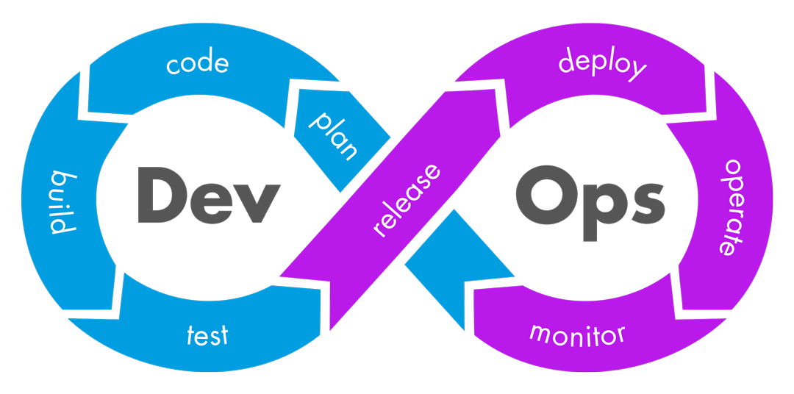
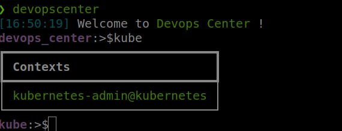
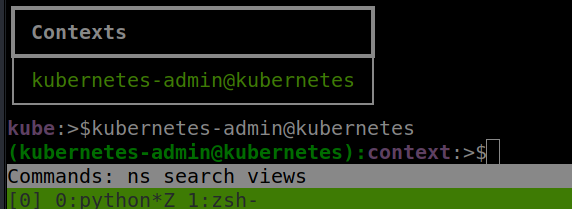
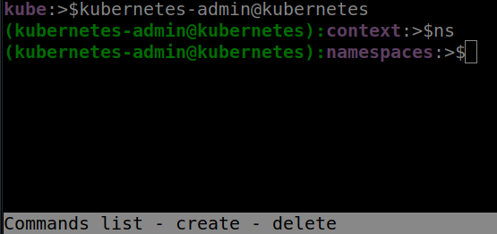

# Devops Center

A single-binary interactive Kubernetes console for day-to-day devops work — pick a
context, walk into a namespace, look at pods / logs / views, without retyping
`kubectl` every time. The UI is inspired by
[pwncat](https://github.com/calebstewart/pwncat).

> **Status:** rewritten from Python to Rust. The original Python implementation
> has been removed; see [`migration.md`](migration.md) and
> [`docs/behaviour-catalogue.md`](docs/behaviour-catalogue.md) for the history
> and rationale.

## Install (Rust)

**From a release:** download the archive for your platform from the
[Releases](../../releases) page, verify the `.sha256`, and put `devopscenter` on
your `PATH`.

**From source** (needs a stable Rust toolchain, see `rust-toolchain.toml`):

```bash
cargo install --path .
# or, without installing:
cargo run --release --
```

## Before you start

Put your kubeconfig files under `~/.kube/` (any filename — the tool scans the
directory recursively and skips anything under a `*cache*` path):

```
~/.kube/config
~/.kube/config_staging
~/.kube/some-team/config
```

Every context in every file is registered, each with its own client.

## Use

### Interactive

```bash
devopscenter
```

Prompt ladder: `kube` → pick a context → `ns` / `search` / `views`.
`ns <name>` walks into a namespace (`pods`, `logs <p>.<c>`, `exec <p>.<c> <cmd…>`,
`delete <p>.<c>`). `help`/`h` lists the current level's commands; `exit` or
Ctrl-D leaves it; Tab completes. History is kept in
`~/.local/share/devopscenter/history.txt`.

### Non-interactive (scripting)

```bash
devopscenter contexts
devopscenter ns   --context prod list
devopscenter ns   --context prod create my-namespace
devopscenter pods --context prod --namespace default
devopscenter logs --context prod --namespace default 0.0
devopscenter search --context prod payments
devopscenter view --context prod usage            # deploy|stateful|hpa|pvc|resources|usage|ingress
```

Add `--output json` to any of the above for machine-readable output.

## Screenshots (from the original Python UI — Rust output is equivalent)

| Contexts | Commands in a context | Namespaces |
|---|---|---|
|  |  |  |

## Contributing

See [`CONTRIBUTING.md`](CONTRIBUTING.md).
